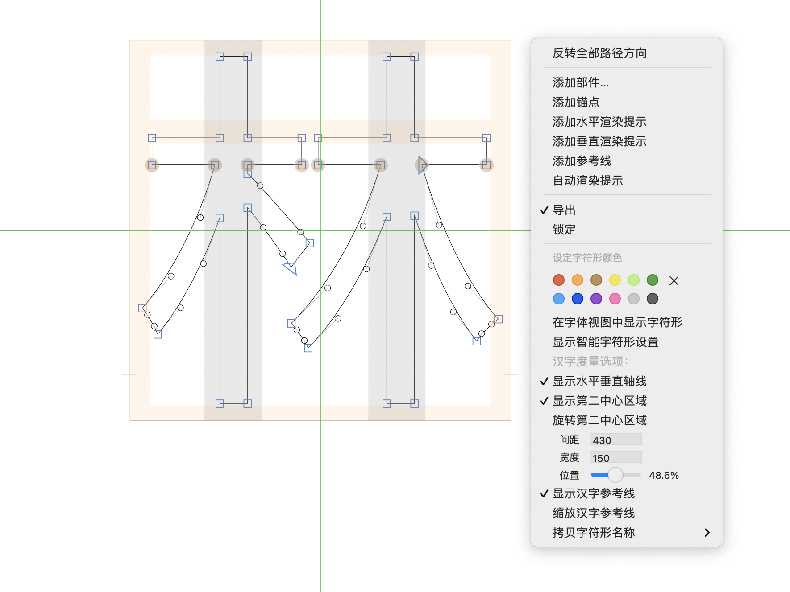

# CJK Metrics

CJK Metrics (zh: 汉字度量) is a plugin for the [Glyphs font editor](http://glyphsapp.com/). It provides comprehensive metrics for CJK fonts, including:

- Medial Axes (水平垂直轴线 / 第一中心线)
- Central Area (第二中心区域)
- CJK Guide (汉字参考线)

## Install

1. Install via the Plugin Manager in Glyphs.
2. Restart Glyphs.

## Examples

## License

Copyright &copy; 2020&ndash;2021 Xiangdong Zeng

Made possible with the [GlyphsSDK](https://github.com/schriftgestalt/GlyphsSDK) by Georg Seifert ([@schriftgestalt](https://github.com/schriftgestalt)) and Rainer Erich Scheichelbauer ([@mekkablue](https://github.com/mekkablue)).

Licensed under the Apache License, Version 2.0 (the "License");
you may not use this file except in compliance with the License.
You may obtain a copy of the License at

<http://www.apache.org/licenses/LICENSE-2.0>

Unless required by applicable law or agreed to in writing, software
distributed under the License is distributed on an "AS IS" BASIS,
WITHOUT WARRANTIES OR CONDITIONS OF ANY KIND, either express or implied.
See the License for the specific language governing permissions and
limitations under the License.
